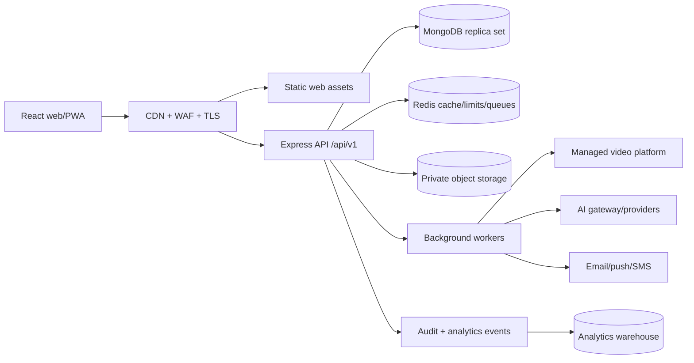
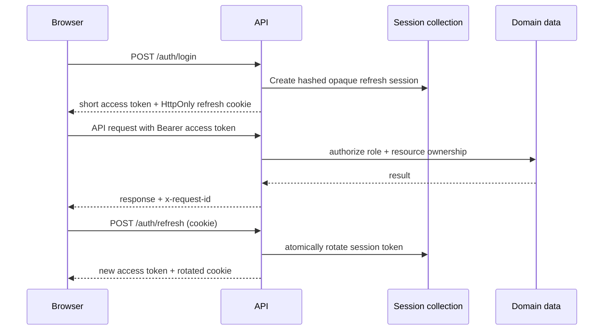
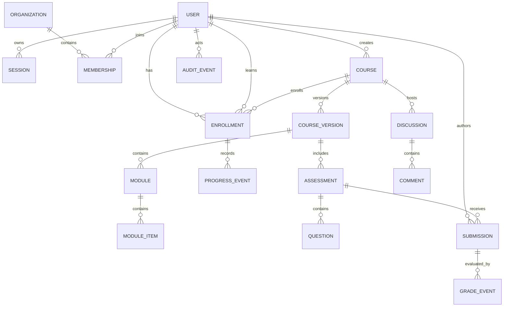

# Cognexa Architecture

## Decision summary

Cognexa uses a modular monolith for the transactional learning core, a React single-page application for authenticated workflows, MongoDB as the system of record, private object storage for files, and provider-backed services for video, email, push, payments, and AI. This shape supports tens of thousands of users without accepting the operational tax of premature microservices.

The supported runtime is `web/` plus `Server/src/`. Legacy code is frozen and removed domain-by-domain after parity, data validation, and rollback windows.



Redis, object storage, workers, and the warehouse are target production capabilities; they are introduced with the workflows that require them rather than as empty infrastructure.

## Runtime boundaries

### Web application

- React Router defines public, authentication, learner, instructor, AI, and administrator route boundaries.
- TanStack Query is the only server-state cache.
- Zustand is restricted to small cross-route client state; sensitive authentication state remains memory-only.
- Lazy route modules prevent role-specific code from entering the public bundle.
- A global error boundary emits a provider-neutral `cognexa:error` event for an observability adapter.
- Public SEO pages should move to SSR/prerendering when organic discovery becomes a growth requirement; the authenticated SPA can remain unchanged.

### API modular monolith

Each domain owns routes, validation, controllers, services, repositories/models, policies, and tests. Controllers translate HTTP; services enforce use cases; repositories/models own persistence. Cross-domain work uses explicit service interfaces or events rather than importing controllers.

Planned modules: identity, organizations, catalog, courses, curriculum, enrollments, progress, assessments, submissions, grading, media, AI, community, notifications, certificates, commerce, search, analytics, audit, and administration.

The current TypeScript modules establish identity, courses, lectures, and AI gateway boundaries. JavaScript controllers and models outside `Server/src/` are migration-only.

### Background execution

External calls and long work—video ingest, file scanning, transcript generation, email, push, certificate rendering, search indexing, AI generation, plagiarism, exports—run through a durable queue. Jobs have idempotency keys, retry/backoff policy, dead-letter handling, timeouts, trace correlation, and an operator replay surface.

## Request and identity flow



The public `GET /auth/session` hint reports only whether the browser sent the refresh cookie. It prevents anonymous pages from producing an expected 401 network error; a positive hint still requires the normal atomic refresh-token rotation and proves no identity by itself.

Access tokens contain only subject, token type, timestamps, and expiry. Authorization is computed from current database state, not embedded role claims. Password changes invalidate older access tokens; session documents expire through a TTL index.

## Data model and relationships



Recommended collection rules and indexes:

| Collection     | Important constraints/indexes                                                |
| -------------- | ---------------------------------------------------------------------------- |
| users          | unique normalized email; unique username; role/status; soft-delete timestamp |
| sessions       | unique token hash; `{user, lastSeenAt}`; TTL on `expiresAt`                  |
| courses        | `{status, publishedAt}`; creator; tenant; slug unique within tenant          |
| courseVersions | unique `{course, version}`; immutable published snapshot                     |
| enrollments    | unique `{user, course}`; `{course, status}`; last activity                   |
| progress       | unique `{user, course, item}`; course/user completion indexes                |
| assessments    | course/version/type/status; deadline; publish window                         |
| submissions    | unique `{assessment, user, attempt}`; grading status; submitted time         |
| notifications  | `{user, readAt, createdAt}`; TTL for ephemeral categories                    |
| auditEvents    | tenant/time; actor/time; resource/time; append-only archive policy           |

Large content, binaries, transcripts, exports, and uploaded answers do not belong in MongoDB. Store object metadata, ownership, checksum, scan status, and lifecycle state in MongoDB; store bytes privately in S3/R2-compatible storage.

## API contracts

- Canonical base path: `/api/v1`.
- JSON errors: `{ error, details?, requestId }`.
- Cursor pagination for high-cardinality timelines; bounded page pagination for catalogs.
- UTC ISO 8601 timestamps and stable string identifiers.
- Idempotency keys for enrollment, payment, publish, and submission writes.
- Optimistic concurrency (`version`/ETag) for course authoring and grading.
- Deprecation and sunset headers precede breaking removals.
- OpenAPI is reviewed with every contract change; generated clients are a future optimization, not the source of authorization truth.

## File and video architecture

1. Browser requests an upload intent containing name, size, type, checksum, and purpose.
2. API authorizes ownership, creates pending metadata, and returns a short-lived signed upload URL.
3. Browser uploads directly to private object storage.
4. Storage event queues malware scan and, for video, managed ingest/transcoding.
5. Worker marks the object ready only after verification and records derived renditions.
6. Authorized playback/download uses short-lived signed URLs; public course artwork uses a CDN-safe derivative.

Limits are purpose-specific. Executable content is rejected. File names are display metadata only; object keys are generated. Downloads use safe content disposition and a separate asset origin.

### Instructor authoring vertical slice

The current instructor slice follows the existing modular-monolith boundary:

```mermaid
flowchart LR
  UI[React instructor workspace] --> Q[TanStack Query API cache]
  UI --> Z[Zustand optimistic edit buffer]
  Q --> API[/api/v1/instructor]
  API --> V[Zod validation]
  V --> A[Ownership and RBAC]
  A --> C[(Course document)]
  UI --> SIG[/api/v1/uploads/cloudinary/signature]
  SIG --> CL[Cloudinary direct upload]
  CL --> Z
```

- MongoDB is the draft source of truth; Zustand holds only the current editing buffer.
- Each autosave sends `draftVersion`. A stale writer receives `409 Conflict` instead of silently overwriting another device's work.
- Modules, lessons, builder quizzes, questions, assignments, rubrics, and asset metadata are embedded in the authoring aggregate so nested ordering is saved atomically.
- Status transitions are explicit and server-enforced. Review and publication run a full readiness check; the API returns every blocking issue to the UI.
- Direct media uploads are signed only after role and course-ownership checks. Cloudinary credentials and the API secret never enter the browser bundle.
- Dashboard totals are calculated from courses, enrollments, achievements, and submissions. Revenue is deliberately `null` until commerce is a real source of truth.

This slice does not replace the future immutable `courseVersions` model. Published-snapshot migration remains the next step before institutions require concurrent cohorts on different versions.

## Scaling and resilience

- Stateless API replicas sit behind a load balancer; sessions, limits, and jobs are not process-local.
- MongoDB uses a managed replica set, point-in-time recovery, connection pool budgets, and tested restores.
- Read-heavy catalog/course responses use CDN or Redis caching with explicit invalidation.
- Queue consumers scale independently and protect external providers with concurrency limits and circuit breakers.
- Backpressure rejects or queues work before exhausting database/provider capacity.
- A single-region highly available deployment is the initial recommendation. Multi-region writes are deferred until an explicit RTO/RPO and revenue case justify the complexity.

## Observability

Every request has a correlation ID propagated to logs, jobs, external provider metadata, errors, and audit events. API logs are structured and redact credentials. Production adds:

- Error tracking with release, route, user/tenant pseudonymous context, and source maps.
- Metrics for request rate/error/duration, database pools and slow queries, queue depth/age, cache hit rate, provider latency/errors, AI tokens/cost, and business journeys.
- Distributed tracing sampled by route and always retained for errors/slow requests.
- Synthetic learner sign-in/catalog/lesson checks and real-user Core Web Vitals.
- SLO-based alerts with actionable runbooks; logs alone are not monitoring.

## Deployment topology

The repository produces independent web and API images. CI runs lint, typecheck, unit/integration tests, production builds, and container builds. A production platform should deploy immutable image digests through staged environments, apply index/migration changes before traffic, run smoke tests, gradually enable flags, and retain the previous image for rollback.
